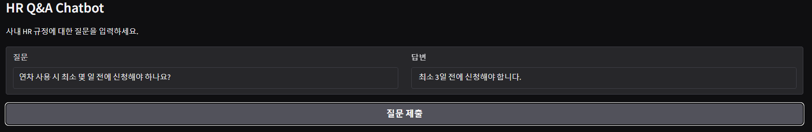

# HR_QA_CHATBOT

사내 HR Q&A 챗봇은 OpenAI gpt-4o-mini와 text-embedding-3-small 기반의 RAG 챗봇입니다. FastAPI로 API를, Gradio로 UI를 구현하여 HR 문의 자동 응대를 목표합니다.

## 📁 프로젝트 구조
```
hr_qa_chatbot/
├── .env
├── app/
│ ├── init.py
│ ├── main.py
│ ├── rag_chain.py
│ └── document_loader.py
├── data/
│ └── hr_policy_qa_samples.csv
└── gradio_frontend.py
└── requirements/
    └── requirements.txt
└── README.md
```

---

## 🛠 사용된 기술 및 모델

- Python
- FastAPI
- LangChain
- Gradio
- Pandas
- Chroma

---

## 🤖 사용된 모델

### LLM : OpenAI `gpt-4o-mini`
- **선택 이유 및 장점**: 비용 대비 성능이 우수하며, 빠른 응답 속도를 제공하여 실시간 챗봇 서비스에 적합합니다. 입력 토큰 1백만 개당 15센트, 출력 토큰 1백만 개당 60센트로 비용 효율적이며, 낮은 지연 시간으로 사용자 경험을 향상시킵니다.
### 임베딩 : OpenAI `text-embedding-3-small`
- **선택 이유 및 장점**: 의미 기반 검색에 최적화된 임베딩 모델로, 빠른 처리와 낮은 자원 소모가 장점입니다. 고품질 텍스트 임베딩을 생성하여 정확한 문서 검색을 가능하게 합니다.

---

## 🚀 실행 방법
### 1. 필요한 패키지를 설치 및 .env파일 생성
.env파일에 OPENAI_API_KEY`를 설정. .env파일은 프로젝트 최상위 폴더에 생성.

### 2. FastAPI 서버를 실행
```
uvicorn app.main:app --reload
```
### 3. 별도의 터미널에서 Gradio 프론트엔드를 실행
```
python gradio_frontend.py
```

---

## 📚 이 프로젝트로 배운 점
- RAG 구조를 이해하고 실제로 구현해보며 의미 기반 검색과 자연어 생성의 결합을 경험했습니다.
- FastAPI를 활용한 비동기 API 서버 구축과 Pydantic을 통한 데이터 검증 방법을 익혔습니다.
- LangChain 라이브러리를 사용하여 문서 임베딩, 벡터스토어 구축, 검색 및 생성 체인을 구성하는 방법을 배웠습니다.
- Gradio를 통해 간단한 웹 UI를 빠르게 구축하는 경험을 쌓았습니다.
- 비동기 처리(`ainvoke`, `await`)를 적용하여 서버의 동시 처리 능력을 향상시키는 방법을 익혔습니다.

---

## 🌐 Gradio를 활용한 웹 배포
